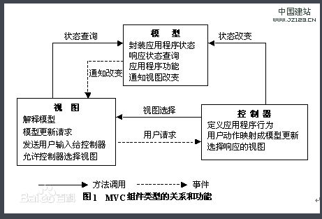
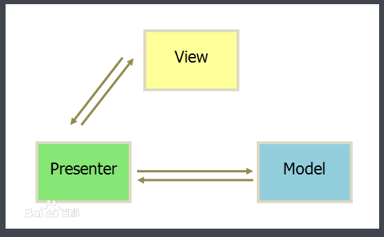
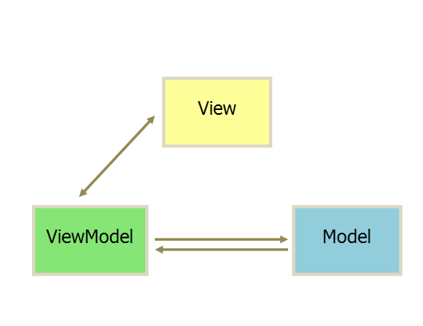

## Android问题
### MVP 、MVC、MVVM
1. MVC： model、view、controller
model：数据提供以及主要业务逻辑
view：界面，只负责展现，没有业务逻辑
controller：尽量少的业务逻辑以及 model和view的桥接
工作流程：用户一个操作，view发送给controller，controller处理完，更新数据model，然后view根据model来更新展示，三者之间是环形关系。

2. MVP：model、view、presenter
model：数据提供以及业务逻辑
view：界面，负责展现
presenter：业务逻辑，以及model和view之间的桥梁，通过model和view的接口将两者关联起来
工作流程：用户一个操作，view发送给presenter来处理，如果有数据变更，则有presenter 操作更新mode，model处理完以后，结果通过presenter反馈给view，三者是双向链表形式。

3. MVVM
model：数据提供以及主要业务逻辑
view：界面，负责展现
viewModel：业务逻辑，以及数据绑定相关，同时比presenter更轻量级，是拆小的presenter
工作流程：用户一个操作，view将操作发送给viewModel，viewModel处理业务逻辑，如果有数据的更改，则通过数据绑定，直接更新model，model的数据更新，也直接通过数据绑定，反馈在view上。viewModel和presenter的最大区别是数据绑定（data binding）上，presenter 需要完成 view和model之间互相操作的逻辑， viewmodel通过 数据绑定来解决了这个问题，从而精简了部分代码。

### bundle化
1. wing框架干的事情
 * APP启动流程
 * bundle初始化
 * bundle间通信
 * 页面框架
 * scheme分发
 
### 学习知识

1. retrofit
  通过注解和接口去发送网络请求、减少了大量重复代码，使用非常方便.  
   * 由注解生成请求，靠的是动态代理(所有请求值定义接口，由动态代理读取注解，生成对象，转发给okHttp或者HttpClient)
   * 使用大量设计模式
    * 适配器：将服务转发到不同的http库
    * 外观模式：多个设置选项封到一个类，方便调用
    * 动态代理: 同上
    
2. 依赖注入：可以实现依赖反转。 自己定义一个接口，表明需要依赖的能力，由使用方将实现类传进来，这样就不用依赖外部，还可以正常工作
3. BIO和NIO： 
    * BIO：阻塞形IO，用IO中读取数据，如果数据还没准备好，就会阻塞当前线程(inputStream、outputStream都是BIO)
    * NIO：非阻塞IO，任何时候读取数据都会直接返回。NIO包含三个重要部分buffer、channel、selector。
     * channel：数据读取通道,相当于 inputStream+outputStream
     * buffer：数据缓冲，用户所有数据操作都是面向buffer的，而不会直接操作channel
     * selector：管理工具，用来管理channel及其状态，NIO不阻塞的一个重要优势就是一个线程就可以管理多个IO操作，每个IO可以设置4个消息(Connect Accept Read Write)，用一个线程轮询多个操作，当轮询到设置的消息时就可以处理。
    * NIO优势：BIO模式时，每个IO操作都需要一个线程（因为会阻塞），比如同一时间有100个请求，就需要100个线程来管理，NIO只需要一个线程轮询就可以了。 
4. directBuffer：使用malloc来分配的内存，不分配在jvm的堆内存中，这样java和 native进行数据传输时，不用拷贝就可以用，效率更高。
   * 其实native可以直接访问jvm的堆内存，为什么还需要directBuffer? jvm堆内存受jvm管理，可能随时发生gc回收、内存整理、数据封装等等，使用者离开jvm 无法确定其状态，因此无法使用，directBuffer在jvm之外，用native方式管理内存，因此可以避开这个风险
   * 什么情况下使用directBuffer？不要java层进行大量数据操作的时候，比如直接的文件拷贝操作，使用堆外内存，可以大大提高速度(减少了jvm<->Native的数据拷贝)

5. java 动态代理和静态代理

  * 静态代理：写一个新的类包装一下原有类，通过包装类去调用原有类。一个包装类可以代理多个类，但是包装类必须包含，需要代理的所有方法。 静态代理可以代理 普通类、接口、抽象类
  * 动态代理：动态创建包装类，可以动态决定代理哪些方法，一个包装类可以代理多个类，而且一个包装方法可以代理多个方法，这样就比静态代理灵活。 
  * 动态代理有两种实现方式：
   - java自带方式(InvocationHandler):利用反射的方式，动态生成包装类，并且可以自定义代理哪些方法。 只能代理接口，普通类、抽象类并不能代理
   - CGLib库实现方式：底层用asm动态生成字节码原理，自动生成一个原有类的子类，重写需要代理的方法，通过java多态即可实现代理功能。可以代理 普通类、接口、抽象类。

6. ConstraintLayout：加强版的RelativeLayout，可以实现LinearLayout、RelativeLayout、TableLayout、FrameLayout的所有能力
7. https：https是SSL(数字证书)加密版的http协议，server会向CA机构申请一个数字证书(用自己的公钥申请)，client链接server，server会将此证书发送给client,client可以通过本地自带的CA根证书或者CA网站去验证此证书是否有效，如果有效则用对称加密算法生成一个秘钥，发送给server，后续数据通信靠对称加密来进行。
   https只有握手时候采用非对称加密，而正常通信采用对称加密，主要原因是对称加密效率较高
8. get、post区别：两者本身都是tcp通信，底层无区别，主要是上层定义上的区别（仅仅是定义，没有强制检查，服务端逻辑并不一定按照定义来走）
   get:定义为从服务端获取资源，不会更新服务器的状态，请求参数一般放到url后面，协议本身没有大小限制，但是某些浏览器或者网络框架会有一定的限制。一般情况下浏览器会将get请求放在浏览历史里面。
   post:定义为向服务器发送数据，可能更新服务端的状态，请求参数一般放在body中，协议本身也没有大小限制。一般情况下不会出现在浏览历史中。
9. AsyncTask 和 Handler
   * AsyncTask：设计的目的是**容易使用**，可以写很少的代码来实现后台服务，同时还可以简单的更新UI(内部封装了主线程Handler)，并且有固定的线程个数，同时做的事情有限制。
   * Handler：自由度更高，可以自己实现各种逻辑
   * 如果是简单的后台操作，比如读一个文件，或者从网上下载一个文件同时还要在UI上更新进度，就可以使用AsyncTask，但是如果要从网上下载大量图片，用Handler就更合适。
10. HashMap、HashTable、ConcurrentHashMap线程安全方面的区别
   * HashMap 线程不安全
   * HashTable 线程安全，主要是在所有方法上加上synchronized实现，效率很低
   * ConcurrentHashMap 采用分段锁的方法，将hashMap 数组分成多段，当某个值写入时，只会锁当前段，其他段无影响，并且只有写入时才锁，读取并不锁
11. HashMap 原理：将key、value封装成Entry，Entry会存放到一个数组中，数组中的位置由key的hash值来决定，如果不同key算出来的位置相同(hash碰撞),则此位置会变成一个链表，相同位置的entry通过一个链表关联起来
    HashMap 扩容：如果Entry数组中的位置被填满了很多，超过一定的阈值，就会对数组进行扩容，然后重新计算所有Entry的Hash位置。
    Entry数组的size一定是2的幂个：原因是key的Hash值很大，需要放在一个很小的数组里面，这个计算位置的方法是hash%size ,如果size是2的n次方个，那么计算方法可以变成 hash&(size-1) = hash%size。&的效率比%高很多
    HashMap 当一个位置上的Entry链表长度超过一定限制后，这个链表会被改写成红黑树：原因大量hash碰撞会导致链表长度过长，查找效率降低，改成红黑树后可以一定程度上保证查找效率
12. LinkedHashMap原理：LinkedHashMap继承自HashMap本身数据存储结构也是HashMap的，仅仅增加了有序遍历的支持，保证有序遍历的原理是，每个Entry在HashMap基础上增加before、after两个对象，用于生成双向链表，每次增加一个数据，数据还是会放到HashMap中，同时还会调整before、after的值，使其能记录插入顺序。
13. Activity、window、View关系
    * Activity：主要是管理工作，负责整个页面生命周期、LaunchMode等等
    * window：SurfaceFlinger处理的最小单位，它包含了一个Surface,Android的图像输出主要由两个canvas和opengl（所有View都是通过canvas画到Window的Surface上），两者都是讲图像画到Surface上，再交给SurfaceFlinger，才能显示在屏幕上，Window有个Z轴概念，用来管理显示层级。
    * View: 最小的显示控制单位，可以生成一个矩形区域的显示内容，最终会画到Window的Surface上，然后显示在屏幕上。
14. view、ViewGroup 渲染流程
15. touch事件分发
16. 热修复、插件化原理
17. RN、weeks、小程序基本原理
18. LRU
19. Activity启动流程
    
    